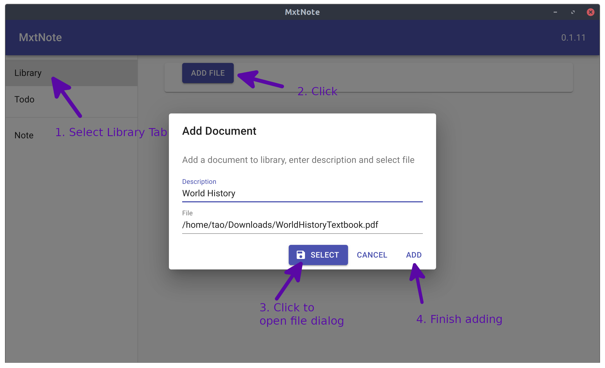
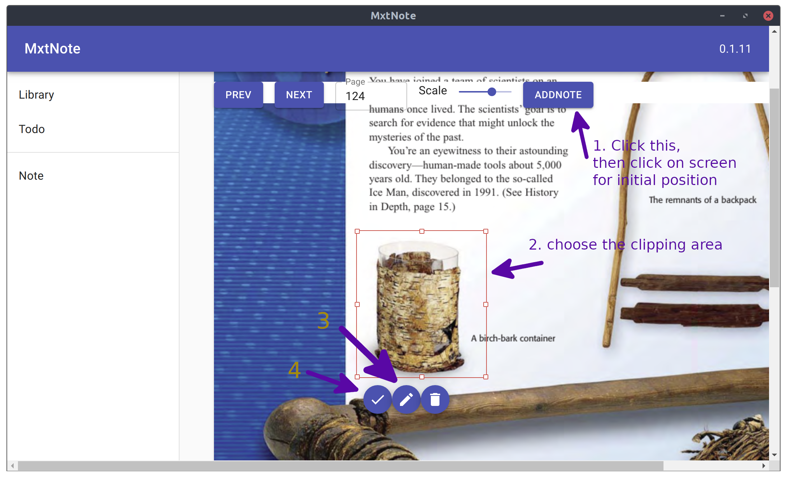

# README

XtNote is an app to manage reading notes and documents and cross reference them

### Compile

This project is based on electron-react-boilerplate, see the README in electron directory for build instruction

### Usage

- Add document to library, click to start reading
  

- Read document, click "AddNote" to add note, use the selection to highlight the context of the note, click on the edit button to edit note text and associate with a todo
  

- View and edit note
  Click on the note to go back to document to read more, or click on the edit button to work on the note, support Mathjax(Latex) math notation with '$' separator (e.g. $a=b\$)
  

- Export/Import: Use export button in the note page to save everything to json file
